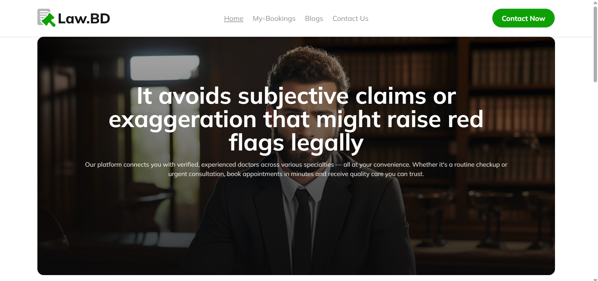

# ⚖️ Lawyer Appointment Booking Application

A responsive, React-based web application that enables users to browse lawyer profiles and seamlessly book appointments. This project demonstrates a well-structured single-page application with routing, state persistence, animations, dynamic charts, and a professional UI.

## 🔗 Live Site

[🌐 Visit Live Website](https://majestic-pudding-1600af.netlify.app/)

## 🧰 Tech Stack

- **Frontend:** React.js, React Router DOM, Tailwind CSS
- **Charts:** Recharts
- **Animation:** react-countup
- **State Persistence:** localStorage
- **Others:** Custom Hooks, Conditional Rendering

## 📸 Screenshot



---

## 📋 Project Overview

This application allows users to:

- Browse a list of professional lawyers with detailed information
- View individual lawyer profiles
- Book appointments based on lawyer availability
- Manage bookings with options to cancel
- See booking statistics using Recharts

---

## 🚀 Features

### 🧭 Navbar

- Site logo, title, and 4 navigation menu items
- Available across all pages including 404

### 🦶 Footer

- Logo, menu, and social icons (except 404 page)

### 🏠 Homepage

- **Banner section** with background image
- **Lawyers section** with 6 cards initially, expandable to 12
- **Success stats** using `react-countup`

### 👨‍⚖️ Lawyer Details

- Shows image, name, experience, fee, speciality, and availability
- “Book Now” functionality with availability check

### 📅 Bookings Page

- View and cancel booked appointments
- Persistent state via `localStorage`
- Dynamic chart of fees using `Recharts`

### 📝 Blog Page

Creative answers to:

- `useState` and its working
- Purpose of `useEffect`
- Custom hooks and their use cases
- Controlled vs Uncontrolled components
- Introduction to `useFormStatus()` in React

### ❌ Error Page (404)

- Displays custom error with a redirect button
- Includes Navbar (not Footer)

---

## 📊 Special Features

- **Recharts Integration:** Visualize booking fees dynamically.
- **react-countup:** Animates statistics.
- **Route-based Loading Animation**
- **Invalid route and ID handling**
- **Optional**: Validates lawyer availability by current date.

---

## 📦 Dependencies

```json
"dependencies": {
  "react": "^18.x.x",
  "react-dom": "^18.x.x",
  "react-router-dom": "^6.x.x",
  "react-countup": "^6.x.x",
  "recharts": "^2.x.x"
}
```

## 🖥️ How to Run Locally

```bash
# Step 1: Clone the repository
git clone https://github.com/your-username/lawyer-booking-app.git

# Step 2: Navigate to the project directory
cd lawyer-booking-app

# Step 3: Install dependencies
npm install

# Step 4: Start the development server
npm run dev
```

## 🔗 Relevant Links

Client Repo: `https://github.com/parvezreza55/lawBooking`

Live Site: `https://majestic-pudding-1600af.netlify.app/`
